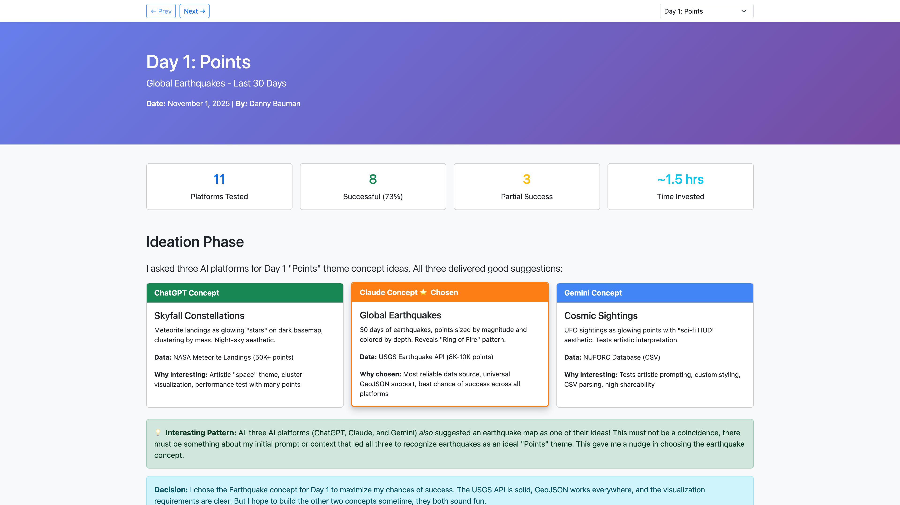
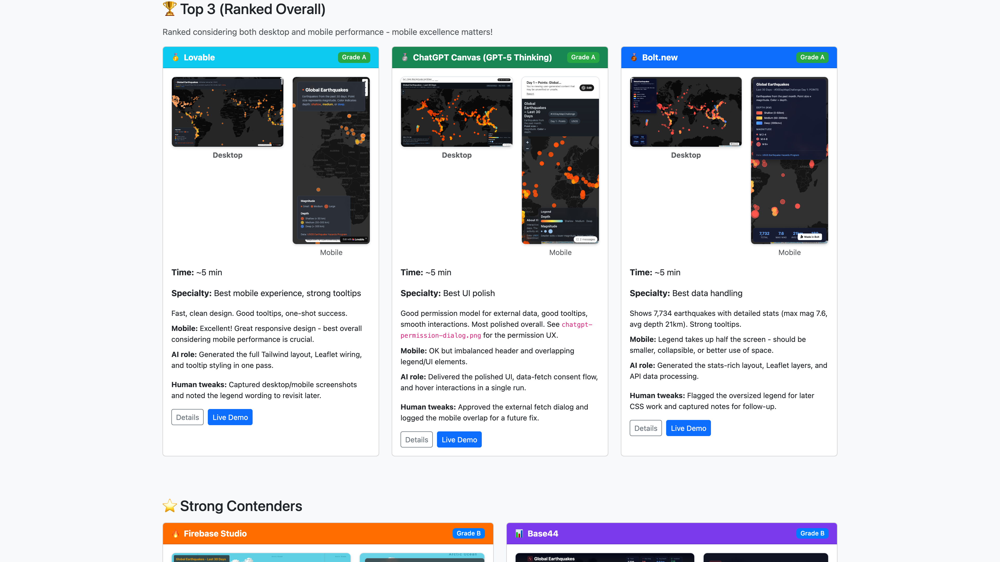

# 30-Day Map Challenge 2025: AI Mapping Experiment

Live site: [https://dannybauman.github.io/30-day-map-challenge-2025/](https://dannybauman.github.io/30-day-map-challenge-2025/)





## Project Overview

For the **[#30DayMapChallenge](https://30daymapchallenge.com/)**, I wanted to use AI as both creative partner and primary developer. The challenge features 30 unique map themes, one per day, and my project explored how top AI models and a variety of AI development platforms could quickly ideate and build map ideas into prototypes. I completed about 10 of the 30 days - I had hoped to do more, but these projects took longer than expected and life got busy. Still, I learned a lot and feel like I could go back and do others more smoothly now with what I've learned. This project provides a November 2025 snapshot of how good these AI tools are for something like this.

**Idea**: Prompt across AI platforms, let them work in parallel, use AI to help journal and report everything.

I approached this with the 30 Day Map Challenge [code of conduct](https://30daymapchallenge.com/#code-of-conduct) in mind: I published only my own work, shared clear data sources, and used AI to evaluate which tools genuinely help human mapmakers instead of letting them replace the creative joy of mapmaking. Huge respect and gratitude to the artists, cartographers, designers, software engineers, storytellers, and everyone else crafting maps without AI - your craft sets the bar and keeps this community grounded in the social and environmental realities that careless AI use can ignore. My goal was to document the good, discard the noise, and feed those lessons back into workflows that stay useful for people.

---

## Parallel Processing Methodology

### The Multi-Platform Approach

Instead of building 1 map per day, my goal was to easily build like 10-20! I used multiple AI models to help come up with ideas, then chose 1-2 to run through a bunch of AI development platforms simultaneously. This showed a comparison of how different tools handle the same geospatial prototyping task.

### To Vibe Code or Not To Vibe Code
For this I mostly used vibe coding with minimal care for code quality or longevity, which is NOT right for most projects. I treated this as a rapid prototyping lab to watch how well AI-assisted development performs in between the human craft steps.

My code of conduct note was my guardrail: I only published work I personally guided, I cited every dataset and called out each AI-assisted contribution, and I talked about when AI shortcuts cost more than they saved. Documenting those wins and misses should make it easier for anyone to decide what tools deserve their time.

Vibe coding is just one way to use AI to help write software. People are inventing new workflows daily, from exploratory prototypes to deep, targeted engineering. My goal here was to surface the useful patterns, flag the dead ends, and keep the focus on the human creativity that makes the challenge magical.

### The Workflow

**Phase 1: Ideation & Concept Selection**
- Used the SAME ideation prompt for all 3 platforms (ensured fair comparison)
- Prompted ChatGPT, Claude, and Gemini models with the identical daily theme prompt
- Pasted back full outputs from all 3 platforms into Cursor
- Cursor logged all ideas and helped analyze/choose the best concept
- If iteration needed: Documented Round 1, human feedback, Round 2 (preserved progression)
- Drafted one implementation prompt based on chosen concept
- Added any theme-specific data requirements

**Phase 2: Parallel Platform Launch**
- Opened 5-15 AI development platforms in browser tabs (ChatGPT, Claude, Gemini, v0, bolt, lovable, etc.)
- Copied/pasted same prompt to each platform
- Hit GO on all of them simultaneously
- Let them work in parallel, saw how it went

**Phase 3: Review & Iteration**
- Checked as they generated results
- Fixed errors as needed (sometimes more, sometimes less attempts)
- Screenshot all attempts, working or not
- Deployed code if possible for sharing
- Optional: Iterated on promising implementations

**Phase 4: Documentation & Analysis**
- Created day folder with subfolders for each platform
- Documented what worked/failed per platform
- Noted patterns, strengths, and failure modes
- Committed everything with platform comparison notes
- Created a visual HTML report for each day to share the results and my thoughts

### Why This Approach?

**Parallel AI**: Multiple AIs working simultaneously generate comparative data efficiently

**Real Comparison**: See which platforms excel at which map types and why

**Push the Limits**: Even failures are valuable documentation of platform limitations

**Lots of Examples**: Generate 5-15 implementations per theme instead of just one

**See How Platforms Compare**: Same prompt, same concept makes for a balanced comparison across platforms

---

## AI Tools Strategy (Multi-Platform Approach)

### Ideation Models (Use 3 for variety)
- **Anthropic Claude Opus 4.5**
- **OpenAI GPT-5.1 Thinking**
- **Google Gemini 3 Pro**

_Note_: These were the picks because newer versions landed mid-challenge. I adapted to the latest stable options as the challenge progressed to keep comparisons current.

### Implementation Platforms (Use 5-15 Daily)

**Tier 1 - Fast Visual Prototypes**
- **Claude Artifacts** - Chat-based frontend prototypes
- **Google Gemini Canvas** - Chat-based frontend prototypes
- **ChatGPT Canvas** - Chat-based frontend prototypes
- **Bolt.new** - Full deployments, handles data files well
- **V0.dev** - Nice UI, design-focused maps
- **Google AI Studio Apps** - Gemini's larger developer platform, new but promising


**Tier 2 - Full-Stack & Advanced**
- **Lovable** - Full apps with multiple pages
- **Cursor** - AI-assisted IDE, new features added frequently
- **Google AntiGravity IDE** - Google's new AI-powered IDE (launched during the challenge), downloadable Mac app, works outside browser, good for larger projects with more control

**Tier 3 - Specialized Tools**
- **MagicPatterns** - Tuned well for well-designed prototypes, component libraries, UI systems
- **Firebase Studio** - Part of a nice big Firebase ecosystem of dev tools
- **Base 44** - New to me, heard it's good

---

## GitHub Repository Structure (Multi-Platform Edition)

```
30-day-map-challenge-2025/
│
├── README.md                          # This document
├── DAILY-LOG.md                       # Quick daily tracker
├── THEMES.md                          # All 30 themes + my notes
├── PLATFORM-TRACKER.md                # Which platforms succeeded per theme
│
├── src/
│   └── pages/                         # Nunjucks templates for each day
│       ├── 01-points.njk
│       ├── 02-lines.njk
│       └── ... (completed days)
│
├── templates/
│   ├── layouts/
│   │   └── day.njk                    # Shared layout template
│   ├── ideation-prompt.txt            # Unified prompt for all AI platforms
│   ├── implementation-base.txt        # Core prompt template
│   └── day-showcase-template.html     # Legacy HTML template (now using Nunjucks)
│
├── maps/                              # Built pages (generated from src/pages/)
│   ├── 01-points/
│   │   ├── index.html                 # Generated from src/pages/01-points.njk
│   │   ├── README.md                  # Overview + platform comparison
│   │   ├── concept.md                 # The chosen idea(s)
│   │   ├── claude-artifacts/
│   │   │   ├── README.md
│   │   │   └── screenshot.png
│   │   ├── chatgpt-canvas/
│   │   │   ├── README.md
│   │   │   └── screenshot.png
│   │   ├── bolt-new/
│   │   │   ├── README.md
│   │   │   └── screenshot.png
│   │   ├── v0-dev/
│   │   ├── lovable/
│   │   └── (other platforms)
│   ├── 02-lines/
│   └── ... (completed days)
│
└── analysis/
    ├── platform-strengths.md          # Which excels at what
    ├── failure-patterns.md             # Common issues per platform
    ├── weekly-reflections.md          # Lessons learned
    └── final-comparison.md            # Month-end platform rankings
```

---

## HTML Pages for Each Day

Each completed day includes an HTML page (`index.html`) for easy browsing and sharing. Pages are built using Nunjucks templates for modularity and consistency:

**What's included:**
- Quick stats and platform comparison
- Ideation concepts from each AI
- Platform results with live demo links
- AI Collaboration Snapshot (summary of where human guided vs. where AI accelerated)
- Process Timeline (detailed play-by-play, collapsed by default)
- Key insights and lessons learned
- Editorial thoughts

**How it works:**
- Source templates: `src/pages/<day-slug>.njk` (uses shared layout from `templates/layouts/day.njk`)
- Built pages: `maps/<day-slug>/index.html` (generated via `npm run build:pages`)
- Makes results easy to browse and share on social media

**View Day 1**: [https://dannybauman.github.io/30-day-map-challenge-2025/maps/01-points/index.html](https://dannybauman.github.io/30-day-map-challenge-2025/maps/01-points/index.html)

---

## Daily Workflow

### Step-by-Step Process

**Step 1: Ideation**
- Used the SAME ideation prompt for Claude, ChatGPT, and Gemini (ensured fair comparison)
- Asked each platform for 2 ideas for the current day's map theme
- Pasted back full outputs from all 3 platforms into Cursor
- Cursor logged all ideas (including iterations if needed) and helped choose the best concept

**Step 2: Prompt Preparation**
- Opened `implementation-base.txt` template
- Customized with: theme, chosen concept, data source
- Copied the prompt to clipboard

**Step 3: Parallel Platform Launch**
Opened in separate tabs:
1. Claude Artifacts (⚠️ struggles with external APIs, but close)
2. Google Gemini Canvas (⚠️ struggles with external APIs, but was close)
3. ChatGPT Canvas
4. Bolt.new
5. V0.dev
6. Google AI Studio Apps
7. Lovable
8. Others...

Pasted prompt in each → Clicked generate → Moved to next

**Step 4: Active Monitoring & Iteration**
- Checked as they generated results
- If one failed early, noted what went wrong
- Recorded any manual fixes (data cleaning, styling tweaks, bug patches) as I applied them
- Screenshot everything as I went

**Step 5: Collection & Organization**
- Deployed code if possible
- Created platform subfolders
- Saved screenshots with consistent naming
- Created quick list of what worked/failed

**Step 6: Documentation**
- Created main README from template
- Filled in platform results (names + status + insights)
- Updated DAILY-LOG.md
- Captured a short “Human review” note that called out what I verified or edited manually
- Created `index.html` page for easy sharing

---

## Deployment & Hosting

### Build the public site
- Requires Node.js 18+.
- Pages are authored in `src/pages/<day>.njk` and built into `maps/` via Nunjucks.
- Build commands:
  - `npm run build:pages:check` — render pages to `maps-build/` for safe diffing.
  - `npm run build:pages` — render pages to `maps/`.
  - `npm run build:site` — generate `docs/` (copies `maps/`, assets, writes `days.json` and `docs/index.html`).
  - `npm run build:all` — `build:pages` + `build:site` in one step.
  - Shortcuts: `npm run dev` (alias for `build:pages:check` + serve docs), `npm run publish` (build pages + set Day 26 as homepage redirect).
  - Local static server: `npm run dev:server` (defaults to serving `docs/` at http://localhost:3000; pass `--dir .` to serve the repo root).
- `docs/index.html` is rebuilt every run with an overview of published days; avoid editing files inside `docs/` by hand.
- **To set a specific day as the homepage**, use either method:
  - **Day number (recommended)**: `node scripts/build-site.mjs 19` (automatically finds `19-projections`)
  - **Day slug**: `DEFAULT_DAY=19-projections node scripts/build-site.mjs`
- To switch back to the overview grid, run without arguments: `node scripts/build-site.mjs`

### Publish with GitHub Pages
- In the repository settings, enable GitHub Pages using the `main` branch and the `/docs` folder.
- Push the updated `docs/` directory whenever you add or edit a day page; GitHub Pages will deploy the latest build automatically.
- The generated site uses relative paths, so it works at both `https://<user>.github.io/<repo>/` and local `file://` previews.

### Adding a new day
- Create/edit `src/pages/<day-slug>.njk` (front matter + `` + ``) using the shared layout (`templates/layouts/day.njk` handles nav/footer scripts).
- Run `npm run build:pages` (or `build:pages:check` for a safe preview) to emit `maps/<day-slug>/index.html`.
- Run `npm run build:site` after adding or updating any day so the manifest, docs build, and navigation stay in sync. Use `DEFAULT_DAY=<slug>` or `node scripts/build-site.mjs <dayNumber>` if you want a different homepage redirect.

### Updating screenshots
- Screenshots for the main README can be updated using the screenshot script in `scripts/` (workaround until better automation tooling is available). The script captures screenshots from the live GitHub Pages site to ensure all features load correctly.

---

## Grading Criteria

**Success Grades (A, B) - Full Success:**
- **A (Excellent)**: Fast, beautiful, fully functional, great mobile UX. Map renders correctly, all features work, responsive design is strong.
- **B (Good)**: Works well, minor issues (e.g., tooltip contrast, legend style), responsive. Map is functional and usable.

**Partial Success (Grades C, D):**
- **C (OK)**: Usable but significant issues (performance problems, UX issues like sluggish pan/zoom). Map works but has notable problems.
- **D (Major Issues)**: Major functionality broken but some elements work. Examples:
  - UI/legends generated but map doesn't load (CSP/CORS issues)
  - Data loads but visualization broken
  - Map loads but interaction doesn't work
- **Key point**: Even CSP/CORS failures that generate UI/legends get Partial Success (C or D), not F. If it generates something useful, it's at least Partial Success.

**Failed (Grade F):**
- No meaningful output displayed (or very little). Examples:
  - Platform returns "internal error" and never generates code
  - Platform crashes before any output
  - Code generated but nothing displays (blank page, no map, no UI)
- **Key distinction**: Grade F is reserved for when there's no meaningful visual output or functionality, not just for code that doesn't work perfectly.

---

## Code of Conduct Compliance

Per the [official challenge](https://30daymapchallenge.com/):
- ✅ All maps are original work (AI-assisted, human-directed)
- ✅ Data sources credited in every README
- ✅ Transparent about AI usage and methodology
- ✅ Focus on creativity, not just automation
- ✅ **AI handles implementation, I handle curation and creative direction**
- ✅ Every map includes a clearly documented human review pass before publishing

**Philosophy**: This project uses AI as a *development multiplier*, not a replacement for human creativity. The insight is in concept selection, platform comparison, and pattern recognition—the AI just codes faster than I can.

---

## Links & Resources

- **Official Challenge**: [30daymapchallenge.com](https://30daymapchallenge.com/)
- **Hashtag**: #30DayMapChallenge
- **Repository**: https://github.com/dannybauman/30-day-map-challenge-2025

### Quick Data Sources
_Note: A comprehensive list of all data sources used across the completed days will be compiled and linked here in the future._

---

## The Goal

This is a comparative AI and usability research project within a mapping challenge:

1. **Benchmark**: How well did 3 AI platforms come up with mapping ideas? How did 15+ AI development platforms handle identical geospatial tasks?
2. **Document**: What patterns emerged in success/failure across tools?
3. **Share**: Created open-source examples others can learn from
4. **Learn**: Built intuition for which AI tools excel where
5. **Contribute**: Multiple map examples to the mapping community

**The key insight**: Basically, it worked! I could quickly ideate and prototype at a fairly high quality level with the help of AI. Each platform has strengths, weaknesses, and quirks, but most of these tools quickly helped me build something cool or interesting or a starting point for something useful.

---

**Date**: November, 2025 |
**By**: Danny Bauman
