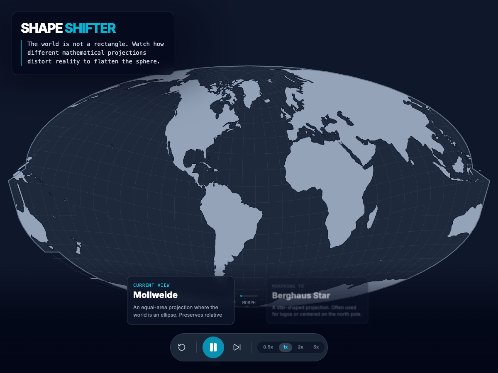

# Gemini 3 Pro – Shape Shifter

Platform: Google AI Studio (Gemini 3 Pro)
Status: ✅ Success
URL: https://shape-shifter-gis-day-903076358991.us-west1.run.app

## Overview

An animated world map that continuously morphs between dramatically different map projections, demonstrating that "the world is not a rectangle" and showcasing the mathematical flexibility of cartography.

## What Works

**Projection Morphing**
- Smooth, continuous animations between multiple projections
- Includes diverse projection types: Equirectangular, Mollweide, Berghaus Star, Sinusoidal, and more
- Graticule (grid lines) deforms along with landmasses for visual clarity

**Interface & Controls**
- Clean, dark theme with cyan accent colors
- Animation controls: Play/Pause, Reset, Skip to next
- Speed controls: 0.5x, 1x, 2x, 5x
- Real-time projection labels with descriptions
- "Current View" and "Morphing To" indicators

**Technical Implementation**
- D3.js with d3-geo and d3-geo-projection
- Natural Earth 110m land data from world-atlas CDN
- SVG rendering for crisp visuals
- Smooth transition interpolation between projection states

**Responsive Design**
- Adapts well to mobile (portrait) and desktop (landscape)
- Touch-friendly controls
- Map scales appropriately to viewport

## Development Notes

**Initial Success (Prompts 1-3):**
- Gemini 3 generated a working morphing animation on first try
- Basic projection sequence and controls implemented
- Data loading from CDN worked without issues

**Refinements (Prompts 4-13):**
- Added more projection variety (expanded from 4 to 6+ projections)
- Improved UI polish (better spacing, typography, color scheme)
- Enhanced animation smoothness and timing
- Added speed controls and better state management
- Refined projection descriptions for educational clarity

## Key Observations

**Gemini 3 Strengths:**
1. **Animation Handling:** Smooth projection interpolation out of the box
2. **D3 Expertise:** Correctly implemented d3-geo projection mutator patterns
3. **Design Sense:** Modern, polished UI without excessive iteration
4. **Iterative Refinement:** Each follow-up prompt improved the experience meaningfully

**GIS Day Success:**
The visualization effectively celebrates GIS Day by making projection theory tangible and engaging. The morphing animations are both educational and visually striking—perfect for social media sharing.

## Screenshots

*Desktop: World in Mollweide projection (equal-area ellipse) with visible graticule*

*Mobile: World in Berghaus Star projection (pentagonal) with touch controls*

